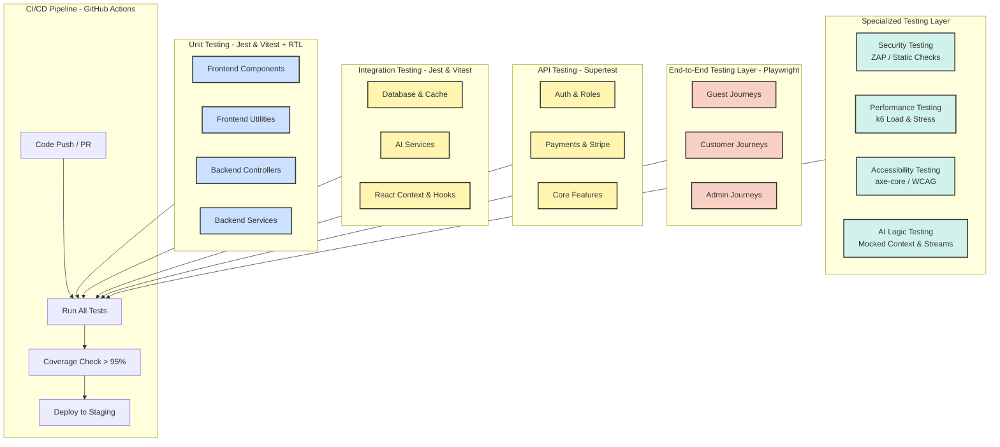

# Software Testing Architecture

This diagram illustrates the multi-layered testing strategy used in the SaaS Platform.

```mermaid
graph TD
    %% Define Styles
    classDef e2e fill:#f9d0c4,stroke:#333,stroke-width:2px;
    classDef integration fill:#fff5b1,stroke:#333,stroke-width:2px;
    classDef unit fill:#cce0ff,stroke:#333,stroke-width:2px;
    classDef specialized fill:#d1f2eb,stroke:#333,stroke-width:2px;

    %% Specialized Testing Layer
    subgraph Specialized_Testing [Specialized Testing Layer]
        A[Security Testing<br/>ZAP / Static Checks]:::specialized
        B[Performance Testing<br/>k6 Load & Stress]:::specialized
        C[Accessibility Testing<br/>axe-core / WCAG]:::specialized
        D[AI Logic Testing<br/>Mocked Context & Streams]:::specialized
    end

    %% E2E Layer
    subgraph E2E_Layer [End-to-End Testing Layer - Playwright]
        E1[Guest Journeys]:::e2e
        E2[Customer Journeys]:::e2e
        E3[Admin Journeys]:::e2e
    end

    %% API Layer
    subgraph API_Layer [API Testing - Supertest]
        A1[Auth & Roles]:::integration
        A2[Payments & Stripe]:::integration
        A3[Core Features]:::integration
    end

    %% Integration Layer
    subgraph Integration_Layer [Integration Testing - Jest & Vitest]
        I1[Database & Cache]:::integration
        I2[AI Services]:::integration
        I3[React Context & Hooks]:::integration
    end

    %% Unit Layer
    subgraph Unit_Layer [Unit Testing - Jest & Vitest + RTL]
        U1[Frontend Components]:::unit
        U2[Frontend Utilities]:::unit
        U3[Backend Controllers]:::unit
        U4[Backend Services]:::unit
    end

    %% CI/CD
    subgraph CI_CD [CI/CD Pipeline - GitHub Actions]
        CI1[Code Push / PR]
        CI2[Run All Tests]
        CI3[Coverage Check > 95%]
        CI4[Deploy to Staging]
        
        CI1 --> CI2
        CI2 --> CI3
        CI3 --> CI4
    end

    %% Connections
    Specialized_Testing --> CI2
    E2E_Layer --> CI2
    API_Layer --> CI2
    Integration_Layer --> CI2
    Unit_Layer --> CI2
```
